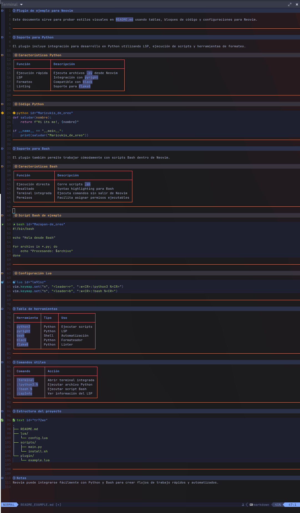

# Welcome to "script_nvim_for_python3"

You can install this script and it will set up everything automatically. It is compatible with **Debian**, **Ubuntu**, and any other Linux distribution based on Debian.

---

## Installation Steps

To get your environment ready, you just need to run the following commands in your terminal:

### 1. Clone the repository
```bash
git clone [https://github.com/svilla123/nvim_for_python_developed.git](https://github.com/svilla123/nvim_for_python_developed.git) ~/.config/nvim
```

### 2. Navigate to the Neovim directory
```bash
cd ~/.config/nvim/ 
```

### 3. Grant execution permissions to the script
```bash
chmod +x install_nvim_to_python.sh
```

### 4. Run the installation script 
```
./install_nvim_to_python.sh
```

One of the functions of this repository is to work with Python syntax as if you were using an IDE, but in a lighter environment powered by Neovim.


Additional features were also added to make it possible to work with documentation directly inside Neovim.




if have any question you can tell me: josesaulvillaperez@gmail.com

